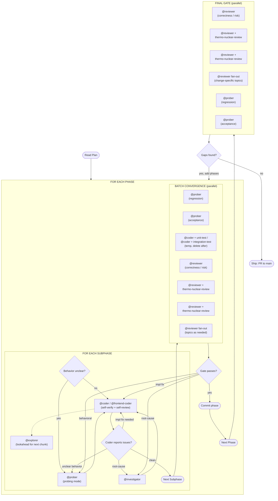

# Execution Model

Rolling pipeline: implement the current chunk while mapping the next one, then converge with heavier review/probe fanout after coherent batches.

## Two Levels

- **Subphase self-review** catches drift early while coder context is fresh.
- **Lookahead** keeps the next chunk warm while implementation runs. Provisional: reconcile against the actual diff before acting.
- **Convergence gates** are loops, not single-pass checks. Spawn reviewers and probers with various skills in parallel, collect findings, fix, re-run affected lanes, repeat until the gate passes. The gate is done when no blocking findings remain.
- **Final gate** proves the whole change set hangs together. Gaps feed back as new phases.

## Runtime Probe Split

Separate prober prompts for verification:

- **Regression**: affected existing behavior still works.
- **Acceptance**: new/changed behavior satisfies requirements.

Run in parallel when they can use isolated state. If shared runtime state could interfere, give them separate runtime roots or run sequentially.

## Fix-Cycle Routing

Route findings to the right specialist:

- **Implementation bugs** → back to coder (context is fresh).
- **Unclear runtime behavior** → `@prober` probe before re-attempting.
- **Root-cause uncertainty** → `@investigator` to diagnose first.
- **Batch-convergence findings** → route by type, re-run affected lanes.
- **Final-gate gaps** → new phase appended to the plan.

## Probe Before Coding

When a subphase depends on runtime behavior that isn't well-understood, spawn `@prober` in probing mode before coding. Probing is cheap; wrong assumptions are expensive.

## Flat Phases

If a phase is small enough for a single coder session, skip subphases: just implement and run batch convergence. Mark flat phases explicitly in the plan.
