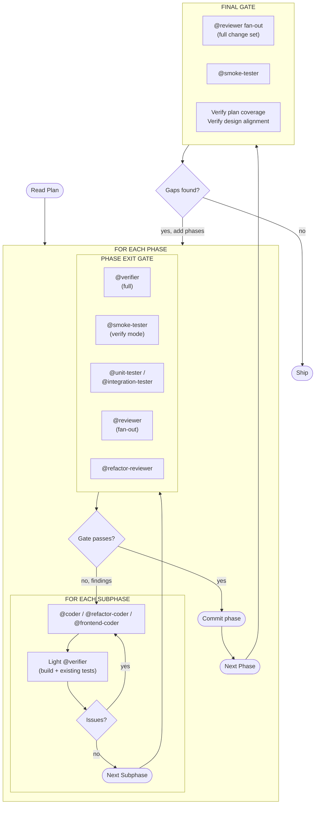

# Execution Model

The plan is executed by @impl-orchestrator as a nested loop: phases outside, subphases inside, with verification at both levels.

## Why Two Levels

- **Light verification between subphases** catches drift early, inside the phase, while context is fresh and the fix is cheap. Full fan-out between subphases would be over-processing.
- **Full gate at phase boundaries** enforces the real quality bar before the phase commits. Subphases can break things temporarily; the gate catches what slipped.
- **Final gate after all phases** proves the whole change set hangs together and matches the design. Discovered gaps feed back as new phases.

## Fix-Cycle Routing

- Light-verification issues within a subphase → back to the same coder spawn (context is still fresh).
- Phase-gate issues → back into the phase, usually as a scoped coder fix followed by re-running the affected lanes, not the full gate.
- Final-gate gaps → new phase appended to the plan, following the normal phase loop.

## When Subphases Are Omitted

If the phase is small enough that a single coder session can finish it before intermediate verification would help, the phase can be flat — no subphases, just the phase exit gate. The plan should mark these explicitly rather than leaving the reader to infer.
