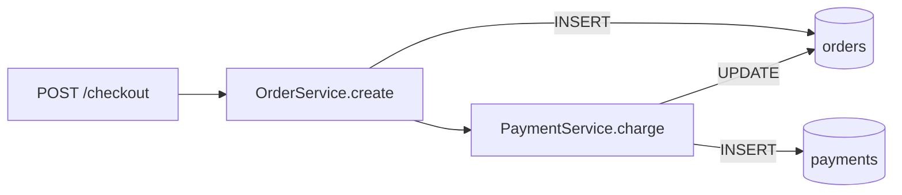

# DB Schema Visualization

Generate an interactive ER diagram from a live database, scoped to the tables relevant to
the walkthrough. The introspection gives you structure and relationships; layer data-flow
annotations from code analysis on top.

## mermerd

Go binary. Multi-DB (Postgres, MySQL, MSSQL, SQLite). Outputs Mermaid `erDiagram` syntax.

```bash
# Subset: only tables involved in the current flow
mermerd -c "$DATABASE_URL" -s public --selectedTables users,orders,payments --outputMode stdout

# Exclude noise (e.g. migration tables, partitions)
mermerd -c "$DATABASE_URL" -s public --useAllTables --ignoreTables "_prisma_migrations,.*_old" --outputMode stdout

# Full schema
mermerd -c "$DATABASE_URL" -s public --useAllTables --outputMode stdout
```

Install globally if not present (`command -v mermerd`): download a prebuilt binary from
https://github.com/KarnerTh/mermerd/releases into a PATH directory (e.g. `/usr/local/bin`)
or `go install github.com/KarnerTh/mermerd@latest` if Go is available.

The output is raw Mermaid: embed it directly in a `structured-artifact` HTML file inside
a `<pre class="mermaid">` block and wire click callbacks per `html-patterns.md`.

If `mermerd` isn't available, see `resources/db-schema-alternatives.md`.

## Layering Data Flow

Schema introspection shows what exists. To show how data moves through those tables:

1. **Identify the flow from code**: which service writes to which table, in what order.
2. **Generate the ER subset**: only the tables involved in this flow.
3. **Add a flowchart** showing mutation sequence on the same artifact page:



4. **Wire click callbacks**: clicking a table node in the ER opens its schema detail;
   clicking a flow node opens the code that performs that mutation.

This gives two complementary views on one page: the static schema (what exists and how
tables relate) and the runtime flow (what happens when a request arrives). Together they
answer both "what is the data model?" and "how does data actually move through it?"
